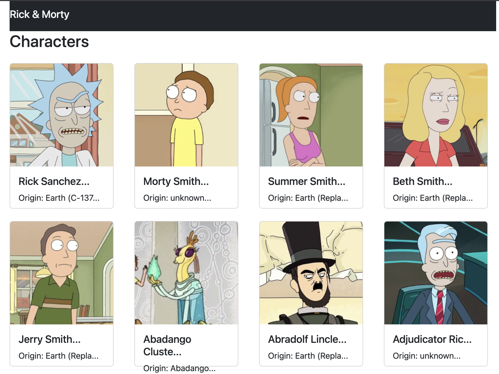

# Rick & Morty - Character Explorer

Una aplicación web interactiva construida con React que permite explorar y conocer los personajes del universo de Rick & Morty. La aplicación consume la API oficial de Rick & Morty para obtener información en tiempo real de todos los personajes.



## 🎯 Funcionalidades

- **Listado de Personajes**: Visualiza una galería completa de todos los personajes de la serie
- **Diseño Responsivo**: Interfaz adaptable que se ve perfecta en dispositivos móviles, tablets y desktop
- **Tarjetas de Información**: Cada personaje se presenta en una tarjeta elegante que muestra:
  - Imagen del personaje
  - Nombre
  - Origen/Procedencia
- **Barra de Navegación**: Navbar fija con el título de la aplicación
- **Carga Dinámica**: Los datos se cargan directamente desde la API de Rick & Morty
- **Indicador de Carga**: Muestra un mensaje mientras se obtienen los datos

## 🛠️ Tecnologías Utilizadas

- **React 19**: Framework de JavaScript para construir interfaces de usuario
- **Bootstrap 5**: Framework CSS para diseño responsivo y componentes
- **Webpack 5**: Bundler para empaquetar la aplicación
- **Babel**: Transpilador de JavaScript moderno
- **API Rest**: Integración con [Rick & Morty API](https://rickandmortyapi.com)

## 📦 Requisitos Previos

- Node.js (v14 o superior)
- pnpm (v11.18.0 o superior)

## 🚀 Instalación

1. **Clonar el repositorio**
   ```bash
   git clone <url-del-repositorio>
   cd RickAndMorty
   ```

2. **Instalar dependencias**
   ```bash
   pnpm install
   ```

3. **Ejecutar en modo desarrollo**
   ```bash
   pnpm run dev
   ```

La aplicación se abrirá en `http://localhost:8080`

## 🏗️ Compilar para Producción

```bash
pnpm run build
```

Esto generará los archivos optimizados en la carpeta `dist/`

## 📁 Estructura del Proyecto

```
src/
├── index.js                      # Punto de entrada de la aplicación
├── index.html                    # Archivo HTML principal
├── styles.css                    # Estilos personalizados
├── components/
│   ├── molecules/
│   │   └── Character.js         # Componente de tarjeta de personaje
│   └── organisms/
│       └── List.js              # Componente contenedor de lista
└── hooks/
    └── useFetch.js              # Hook personalizado para obtener datos
```

## 🎨 Componentes

### Character (Molécula)
Componente reutilizable que muestra la información de un personaje individual en formato de tarjeta.

**Props:**
- `name`: Nombre del personaje
- `image`: URL de la imagen del personaje
- `origin`: Lugar de origen del personaje

### List (Organismo)
Componente contenedor que gestiona la obtención de datos de la API y renderiza la lista de personajes.

### useFetch (Hook Personalizado)
Hook reutilizable que simplifica las llamadas HTTP y gestiona:
- Estados de carga
- Manejo de errores
- Caché de datos

## 🔌 API Integration

La aplicación utiliza la **Rick & Morty API** (https://rickandmortyapi.com/api/character) para obtener:
- Lista de personajes
- Imágenes de personajes
- Información de origen
- Datos adicionales de cada personaje

## 💡 Características Técnicas

- **Componentes Funcionales**: Uso de componentes funcionales con React Hooks
- **State Management**: Gestión de estado con `useState`
- **Effects**: Efectos secundarios con `useEffect`
- **Responsive Design**: Grid system de Bootstrap para adaptar el layout
- **Error Handling**: Manejo de errores en las peticiones HTTP
- **Loading States**: Estados de carga para mejorar UX

## 🔮 Posibles Mejoras Futuras

- Agregar filtrado por tipo de personaje
- Implementar búsqueda y paginación
- Agregar detalles adicionales en modal
- Favoritos/Carrito de compras
- Tema oscuro/claro
- Tests automatizados

## 📝 Licencia

ISC

## 👤 Autor

Mauricio Rojas (mrojasb2000@gmail.com)

---

¡Disfruta explorando el universo de Rick & Morty! 🚀👨‍🚀
